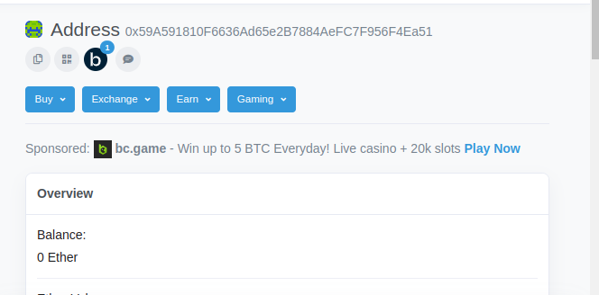

# Sample Hardhat Project

This project demonstrates a basic Hardhat use case. It comes with a sample contract, a test for that contract, and a script that deploys that contract.

Try running some of the following tasks:

shell
npx hardhat help
npx hardhat test
REPORT_GAS=true npx hardhat test
npx hardhat node
npx hardhat run scripts/deploy.js

Deploy your ERC20 tokens on Goerli testnet and use etherjs to interact with all the ERC20 standard functions.
# Helpful resources
 
 
 - [Hard Hat tutorial](https://hardhat.org/tutorial)

 - [Connect dapp to metamask wallet using etherjs](https://surajondev.com/2022/09/05/connect-dapp-to-metamask-wallet-using-ether-js/)
    

 - [Building a DApp with Ether.Js](https://blog.logrocket.com/building-dapp-ethers-js)
    
 - [Writing and Testing a Smart Contract With Hardhat and Ethers.js](https://betterprogramming.pub/writing-and-testing-a-smart-contract-with-hardhat-and-ethersjs-2b0dbd450997)
    
 - [Interact With Your Smart Contract](https://www.web3.university/tracks/create-a-smart-contract/interact-with-your-smart-contract)
    
 - [Hardhat Guides Setup](https://www.chainshot.com/article/hardhat-guides-setup)
    
 - [How to Deploy Your Own ERC-20 Token](https://www.web3.university/article/how-to-deploy-your-own-erc-20-token)

  Deployed contract viewed at etherscan.io with token address
    
 